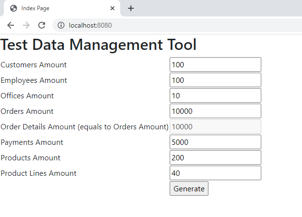
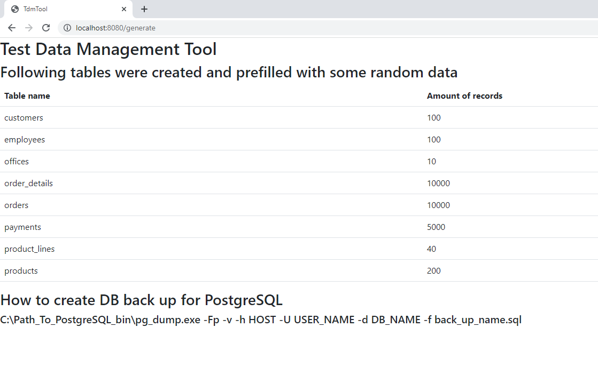
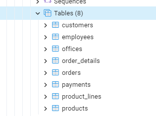

# TestDataGenerator

This is a training project, the purpose of which was to understand some technology.

Functionality: generation of a database with test data, all entities (tables) and connections between them are described in Java code. The data is generated similar to real names, phone numbers and addresses, which in general can allow to fill test bases in test automation (only for this you will need to fully customize tables).

Technologies:
1. Spring Boot
2. Spring Data JPA
3. Thymeleaf
4. GitHub JavaFaker

Steps to interact with app:
1. Application answers on the http://localhost:8080/ and returns following form (it allows to choose needed amount of entities to be generated):
   1. 
2. Click on button 'Generate' leads to endpoint '/generate', that method is responsible for all data generation: it creates all needed collections of data, saves it to DB and after all data is generated method returns table with amounts of all records 
   1. 
3. If you want to create backup of created DB you have to do it manually (there is the command for PostgreSQL on the result page). But if you set up another DB you will have to perform it manually.
4. Result DB 
   1. 
5. Application recreates all tables and foreign keys after each run.
